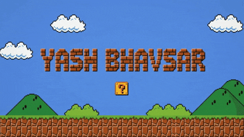
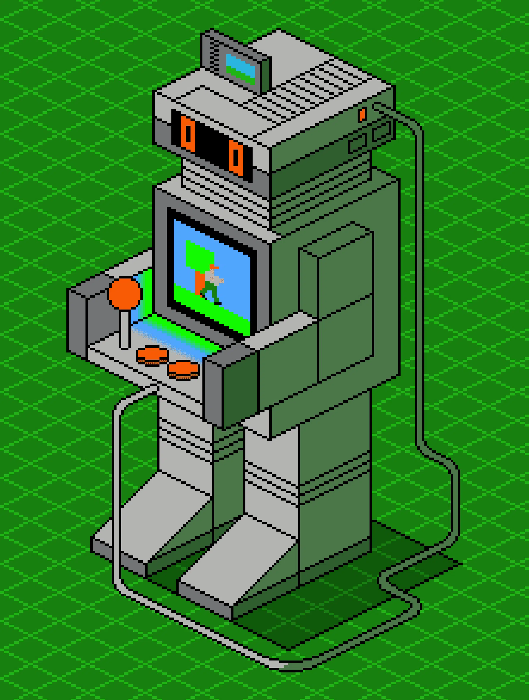
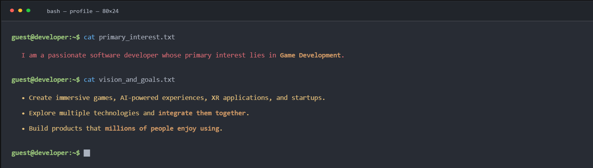
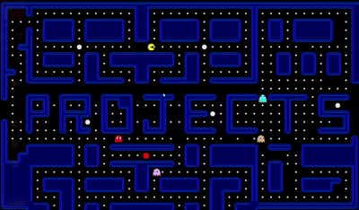
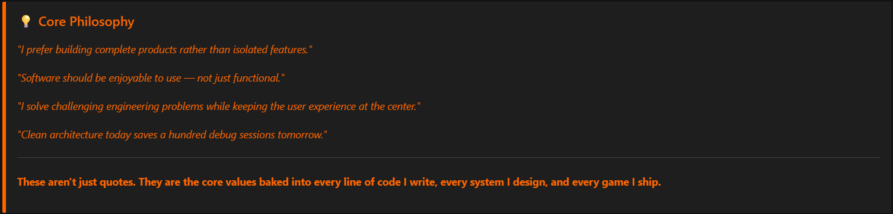

<div align="center">

#  Hey there! Everyone**


<!-- 🎮 ADD MARIO / PIXEL ART HERO GIF HERE — recommended size: width="100%" or centered ~500px -->

<!-- Example:  -->

<br/>

[](https://git.io/typing-svg)

<br/>

[](https://github.com/YashGames2007)
[](https://yashgames2007-dev-portfolio-web.netlify.app/)
[](https://drive.google.com/file/d/1YXAU3d5AghnW1lflJci5q4cNsfMXj0ZE/view?usp=drive_link)

</div>
<br>


---
<br>
    
<div align="center">

```
 ██╗    ██╗███████╗██╗      ██████╗ ██████╗ ███╗   ███╗███████╗██╗
 ██║    ██║██╔════╝██║     ██╔════╝██╔═══██╗████╗ ████║██╔════╝██║
 ██║ █╗ ██║█████╗  ██║     ██║     ██║   ██║██╔████╔██║█████╗  ██║
 ██║███╗██║██╔══╝  ██║     ██║     ██║   ██║██║╚██╔╝██║██╔══╝  ╚═╝
 ╚███╔███╔╝███████╗███████╗╚██████╗╚██████╔╝██║ ╚═╝ ██║███████╗██╗
  ╚══╝╚══╝ ╚══════╝╚══════╝ ╚═════╝ ╚═════╝ ╚═╝     ╚═╝╚══════╝╚═╝
```

</div>


---
<br>

[](https://github.com/YashGames2007)
## 🕹️ PRESS START — Player Profile



```csharp
namespace GameWorld.Players
{
    public class YashBhavsar : Developer
    {
        public string Name       = "Yash Bhavsar";
        public string Role       = "Game Dev · AI Engineer · XR Builder";
        public string Location   = "Pune, MH, India";
        public string Status     = "Artificial Intelligence & Data Science Student";
        public string College    = "Dr. D. Y. Patil College of Engineering, Akurdi";

        public string[] Classes  = {
            "Unity Game Developer",
            "AI Engineer",
            "XR / VR Developer",
            "Full Stack Developer",
            "Open Source Builder",
            "Future Startup Founder"
        };

        public string ActiveQuest =
            "Building Orbit — an AI startup";

        public string FinalBoss  =
            "Own Indie Game Studio + AAA Titles";

        public bool IsHiring     = false;
        public bool IsOpen       = true; // collabs & contributions
    }
}
```

<br clear="right"/>

[](https://github.com/YashGames2007)


## 🍄 LEVEL 01 — The Origin Story



<!-- 🎮 ADD YOUR FIRST IN-BODY GIF HERE — e.g. retro pixel scene, arcade, or coding gif -->
<!-- Example: <div align="center"></div> -->

<br/>

<div align="center">
  <table width="90%" style="border-collapse: separate; border-spacing: 12px; font-family: 'Fira Code', monospace; background: transparent;">
    <thead>
      <tr style="text-align: left; font-size: 16px; color: #8b949e;">
        <th style="padding-left: 8px; padding-bottom: 4px; font-weight: 600;">🎯 Primary Interests</th>
        <th style="padding-left: 8px; padding-bottom: 4px; font-weight: 600;">🔭 Secondary Interests</th>
      </tr>
    </thead>
    <tbody>
      <tr>
        <td style="background: #161b22; color: #c9d1d9; padding: 14px 18px; border-radius: 8px; border: 1px solid #30363d; border-left: 4px solid #ff7b72; font-size: 14px; font-weight: 500;">Game Development & Unity</td>
        <td style="background: #161b22; color: #c9d1d9; padding: 14px 18px; border-radius: 8px; border: 1px solid #30363d; border-left: 4px solid #58a6ff; font-size: 14px; font-weight: 500;">Web Development</td>
      </tr>
      <tr>
        <td style="background: #161b22; color: #c9d1d9; padding: 14px 18px; border-radius: 8px; border: 1px solid #30363d; border-left: 4px solid #ff7b72; font-size: 14px;">Artificial Intelligence</td>
        <td style="background: #161b22; color: #c9d1d9; padding: 14px 18px; border-radius: 8px; border: 1px solid #30363d; border-left: 4px solid #58a6ff; font-size: 14px;">Automation</td>
      </tr>
      <tr>
        <td style="background: #161b22; color: #c9d1d9; padding: 14px 18px; border-radius: 8px; border: 1px solid #30363d; border-left: 4px solid #ff7b72; font-size: 14px;">XR / VR Development</td>
        <td style="background: #161b22; color: #c9d1d9; padding: 14px 18px; border-radius: 8px; border: 1px solid #30363d; border-left: 4px solid #58a6ff; font-size: 14px;">Computer Vision</td>
      </tr>
      <tr>
        <td style="background: #161b22; color: #c9d1d9; padding: 14px 18px; border-radius: 8px; border: 1px solid #30363d; border-left: 4px solid #ff7b72; font-size: 14px;">Gameplay Programming</td>
        <td style="background: #161b22; color: #c9d1d9; padding: 14px 18px; border-radius: 8px; border: 1px solid #30363d; border-left: 4px solid #58a6ff; font-size: 14px;">Cloud Computing</td>
      </tr>
      <tr>
        <td style="background: #161b22; color: #c9d1d9; padding: 14px 18px; border-radius: 8px; border: 1px solid #30363d; border-left: 4px solid #ff7b72; font-size: 14px;">Backend & Architecture</td>
        <td style="background: #161b22; color: #c9d1d9; padding: 14px 18px; border-radius: 8px; border: 1px solid #30363d; border-left: 4px solid #58a6ff; font-size: 14px;">Developer Tools</td>
      </tr>
      <tr>
        <td style="background: #161b22; color: #c9d1d9; padding: 14px 18px; border-radius: 8px; border: 1px solid #30363d; border-left: 4px solid #ff7b72; font-size: 14px;">Product Development</td>
        <td style="background: #161b22; color: #c9d1d9; padding: 14px 18px; border-radius: 8px; border: 1px solid #30363d; border-left: 4px solid #58a6ff; font-size: 14px;">Machine Learning</td>
      </tr>
      <tr>
        <td style="background: #161b22; color: #c9d1d9; padding: 14px 18px; border-radius: 8px; border: 1px solid #30363d; border-left: 4px solid #ff7b72; font-size: 14px;">Interactive Experiences</td>
        <td style="background: #161b22; color: #c9d1d9; padding: 14px 18px; border-radius: 8px; border: 1px solid #30363d; border-left: 4px solid #58a6ff; font-size: 14px;">Education Technology</td>
      </tr>
      <tr>
        <td style="background: #161b22; color: #c9d1d9; padding: 14px 18px; border-radius: 8px; border: 1px solid #30363d; border-left: 4px solid #ff7b72; font-size: 14px;">NPC Intelligence</td>
        <td style="background: #161b22; color: #c9d1d9; padding: 14px 18px; border-radius: 8px; border: 1px solid #30363d; border-left: 4px solid #58a6ff; font-size: 14px;">Product Development</td>
      </tr>
    </tbody>
  </table>
</div>


[](https://github.com/YashGames2007)


<br>

## ⚔️ LEVEL 02 — Arsenal (Tech Stack)

> Every great warrior knows their weapons. Here's the full loadout.

<div align="center">

### 🎮 Game Development


### 🧠 AI & Machine Learning


### 🖥️ Backend & Full Stack


### 🗄️ Databases & Cloud


### 🔧 Dev Tools & Languages


---
### 🎮 Gaming Vibes


<!-- Pixel art joystick + GTA + Mario badges -->


</div>

<!-- Pixel art divider: joystick icons -->
<div align="center">

```
  🕹️  🎮  👾  🏎️  🏁  🌟  🕹️  🎮  👾  🏎️  🏁  🌟  🕹️  🎮
```

<div style="width: 100%; text-align: center;">
  <a href="https://github.com/YashGames2007" style="display: block; width: 100%;">
    
  </a>
</div>




</div>


## 🏰 LEVEL 03 — The Projects Dungeon

> These aren't just repos. These are **boss fights I already won.**

<!-- 🎮 ADD SECOND IN-BODY GIF HERE — e.g. coding, Unity editor, game screenshot, XR gif -->
<!-- Example:  -->

### 🌟 Flagship Builds

<table>
<tr>
<td width="50%" valign="top">

**🐕 [RamXR — Canine](https://github.com/YashGames2007/RamXR-Canine)**

XR educational application for veterinary students. Immersive anatomy simulations built in Unity with OpenXR and Meta Quest support. Real learning, virtual world.

`Unity` `XR` `OpenXR` `Meta Quest` `C#`

⭐ 1 · 🍴 6

</td>
<td width="50%" valign="top">

**🔍 [Fraud Detection System](https://github.com/YashGames2007/Fraud-Detection-System-Backend)**

AI-powered financial fraud detection. Real-time transaction analysis, risk scoring using Isolation Forest + XGBoost. Production-grade architecture.

`Spring Boot` `FastAPI` `MongoDB` `Redis` `XGBoost`

</td>
</tr>
<tr>
<td width="50%" valign="top">

**🧠 [Knowledge Buddy](https://github.com/YashGames2007/Knowledge-Buddy)**

AI-powered learning companion. Built to make education more accessible and interactive.

`AI` `Web` `Education Tech`

</td>
<td width="50%" valign="top">

**🍽️ [Aaswad](https://github.com/YashGames2007/Aaswad)**

Modern food ordering web platform with a clean, responsive UI focused on seamless user experience.

`Web` `Full Stack` `UX`

</td>
</tr>
<tr>
<td width="50%" valign="top">

**🤖 [Jarvis 2.0](https://github.com/YashGames2007/Jarvis-2.0)**

Desktop AI assistant with voice interaction and automation. Modular architecture, upgraded from the original Jarvis.

`Python` `AI` `Voice` `Automation`

</td>
<td width="50%" valign="top">

**💬 [Dialogue System](https://github.com/YashGames2007/Dialogue-System)**

Reusable Unity dialogue framework for NPC conversations. Designed for future AI integration.

`Unity` `C#` `Game Systems`

</td>
</tr>
</table>

### 🎮 Game Builds

| Game | Description |
|------|-------------|
| ⌨️ [Typing Runner](https://github.com/YashGames2007/Typing-Runner) | Browser-based typing speed game with real gameplay loop |
| ♟️ Chess | Classic chess engine implementation |
| 🐦 Flappy Bird | Unity remake of the classic |
| 🐍 Snake Game | Faithful pixel recreation |
| 🎲 Snake & Ladders | Board game digitized |
| 🟦 Tic Tac Toe + AI | With unbeatable AI opponent |
| 🌍 [Main Terrain](https://github.com/YashGames2007/Main-Terrain) | Unity terrain + world-building prototype |

### ⚙️ Systems & Tools

> [Appointment Booking Backend](https://github.com/YashGames2007/Appointment-Booking-Backend) · [Traffic Moderation](https://github.com/YashGames2007/Traffic-Moderation) · [EDI Parser](https://github.com/YashGames2007/EDI-Parser) · [UPI Demo Backend](https://github.com/YashGames2007/UPI-Demo-Backend) · [MyCodePrograms](https://github.com/YashGames2007/MyCodePrograms)

[](https://github.com/hiradEmami)


## 📊 LEVEL 04 — Stats Screen

<div align="center">


&nbsp;&nbsp;


<br/><br/>


</div>

<br/><br/>
<div align="center">
  
</div>


<div style="width: 100%; text-align: center;">
  <a href="https://github.com/YashGames2007" style="display: block; width: 100%;">
    
  </a>
</div>


## 🗺️ LEVEL 05 — Skill Tree

> Self-taught. No respawns. Every skill earned the hard way.


```
GAME DEV      ████████████████████ 100%  Unity 6 · XR · Shaders · NPC Systems
BACKEND       ███████████████░░░░░  75%  Spring Boot · Node.js · REST · Redis
AI / ML       ██████████████░░░░░░  70%  Python · XGBoost · Isolation Forest
FULL STACK    █████████████░░░░░░░  65%  React · TypeScript · Firebase · MongoDB
MOBILE        ████████░░░░░░░░░░░░  40%  Android · Kotlin
SYSTEM DESIGN ████████████░░░░░░░░  60%  MVC · Microservices · Architecture
CS THEORY     ████████████████░░░░  80%  DSA · OOP · Design Patterns · OS
```

<div style="width: 100%; text-align: center;">
  <a href="https://github.com/YashGames2007" style="display: block; width: 100%;">
    
  </a>
</div>

## 🏆 LEVEL 06 — Hall of Fame

<div align="center">

| 🥇 Achievement | 🗓️ Details |
|---|---|
| 🏆 TechFiesta Hackathon | **Runner-up** — International Hackathon |
| 🎓 CS50x | Harvard OpenCourseWare — Completed |
| 🦈 Pull Shark ×2 | GitHub Achievement Unlocked |
| ⚡ Quickdraw | GitHub Achievement Unlocked |
| 🔬 RamXR — Canine | XR Educational Software — Deployed |
| 🤖 Fraud Detection | Production-grade AI backend — Built |
| 🌍 Open Source | 15+ public repositories — Active |

</div>

<div style="width: 100%; text-align: center;">
  <a href="https://github.com/YashGames2007" style="display: block; width: 100%;">
    
  </a>
</div>

## 🔭 LEVEL 07 — Active Mission & Roadmap

<!-- 🎮 ADD THIRD IN-BODY GIF HERE — e.g. spaceship, rocket launch, future/neon themed -->
<!-- Example:  -->

### ⚡ What I'm Building Right Now

- 🚀 **Orbit** — AI startup (stealth mode, building fast)
- 🧠 **NPC Interaction System** — Intelligent Unity dialogue & behaviour engine
- 🌐 **XR Applications** — Next-gen Meta Quest experiences
- 📦 **Open Source Portfolio** — Quality > quantity, always
- 🎮 **Unity Games** — Targeting itch.io + Steam

### 🗓️ 5-Year Game Plan

```
2025  ──▶  Launch Orbit MVP · Publish first Unity game · Finish XR project
2026  ──▶  Grow Orbit · Release 2nd game · Internship at game studio
2027  ──▶  Graduate · Join AAA studio or found indie team
2028  ──▶  Fund indie studio · Ship Steam game · Orbit Series A
2029  ──▶  Own studio + AI startup + products used by millions
```

<div style="width: 100%; text-align: center;">
  <a href="https://github.com/YashGames2007" style="display: block; width: 100%;">
    
  </a>
</div>

## 💭 LEVEL 08 — Developer Philosophy



[](https://github.com/YashGames2007)


## 📡 LEVEL 09 — Multiplayer Lobby (Connect)

<div align="center">

[](https://yashgames2007-dev-portfolio-web.netlify.app/)
[](https://linkedin.com/in/yashgames2007)
[-000000?style=for-the-badge&logo=x&logoColor=white)](https://twitter.com/yashgames2007)
[](https://instagram.com/yashgames2007)
[](https://medium.com/@yashgames2007)

[](https://www.leetcode.com/yashgames2007)
[](https://stackoverflow.com/users/17628133)
[](https://kaggle.com/yashgames2007)
[](https://auth.geeksforgeeks.org/user/yashgames2007)
[](https://codepen.io/yashgames2007)
[](https://g.dev/YashGames2007)
[](https://scholar.google.com/citations?user=Ybob6mUAAAAJ)

<br/>

<a href="mailto:yashbhavsar.dev2007@gmail.com">
  
</a>
<br><br>

</div>

---

<!-- FOOTER -->
<div align="center">

<!-- 🎮 ADD PAC-MAN / SPACE INVADERS / PIXEL ART FOOTER GIF HERE -->
<!-- Example:  -->

<br/>


*"I have learnt many programming skills but still a beginner and eager to learn more."*

**— Yash Bhavsar**

<br/>

```
[ GAME OVER? NOPE. PRESS START TO CONTINUE → ]
```

</div>
